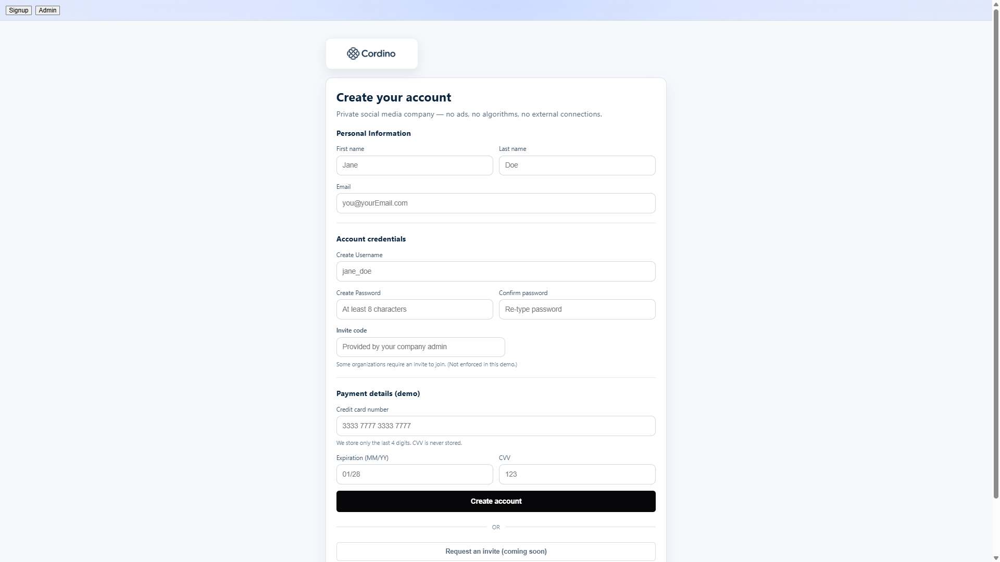
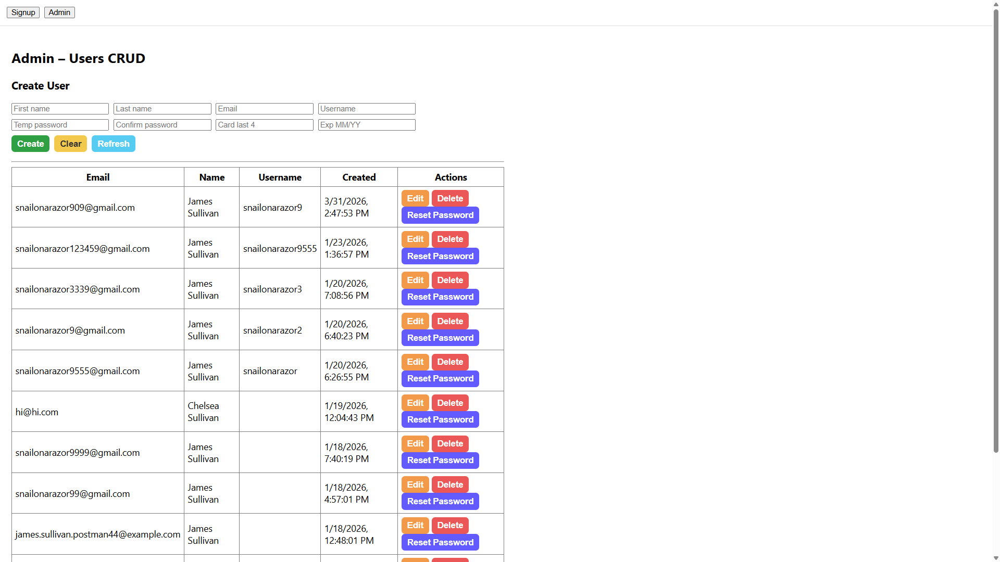

# Cordino Signup + Admin App

Simple full-stack app with a React frontend and Node/Express backend.

Users can sign up through a form, and admins can manage users through a basic CRUD dashboard.

---

## Preview

---

## Features

- User signup form with validation
- Admin dashboard (create, view users)
- Full-stack setup (React + Express + MongoDB)

---

## Tech Used

Frontend:
- React
- CSS

Backend:
- Node.js
- Express
- MongoDB

---

## How to Run

### Server
- cd server
- npm install
- npm run dev

### Client
cd client
npm install
npm start

---

## Notes

- Uses environment variables for MongoDB connection
- `.env` is not included (see `.env.example`)

---

## Future Improvements

- Add authentication (login/logout)
- Improve UI styling
